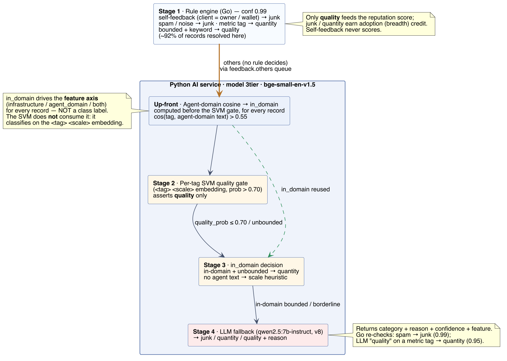

# ERC-8004 AI Service

Standalone Python service that owns all AI logic for the [ERC-8004 benchmarking platform](https://github.com/StrongDZ/erc-8004-benchmarking-platform). The Go backend ([`erc-8004-benchmarking-be`](https://github.com/StrongDZ/erc-8004-benchmarking-be)) calls this service over HTTP for any feedback record that falls through the rule-based classifier.

## Three concerns in one package

1. **HTTP service** under [`app/`](app/) — FastAPI exposing `/classify`, `/summarize`, `/embed`, `/health`. This is what Go talks to in production.
2. **Benchmarks** under [`benchmarks/`](benchmarks/) — the classifier experiments behind the thesis evaluation: Naive Bayes, frozen-embedding, LLM-only, fine-tuned ModernBERT, and the production cascade, compared on the same hand-labelled gold set. Results and write-ups are in [`docs/`](docs/).
3. **Research notebooks** under [`notebooks/`](notebooks/) — the early exploratory study (zero-shot LLM, embedding + classical ML, few-shot LLM).

All three reuse [`shared/`](shared/).

## Category schema



4 categories:

```text
junk | quantity | quality | others
```

The LLM emits one of the first three (it never returns `others`); `others` is the rule-classifier's fallback bucket for rows that didn't match any rule. Only `quality` feeds the reputation score.

## Production cascade

The rule engine in the Go backend resolves the large majority of feedback (~92% on the live corpus) with no AI call. The residual is sent to `POST /classify`, whose `model` field selects the backend:

| `model` | Backend |
|---|---|
| *(empty)* | Zero-shot LLM via Ollama (default `qwen2.5:7b-instruct`) |
| `3tier` | Production cascade: per-tag SVM (asserts `quality` above τ = 0.70) → agent-domain cosine similarity (resolves `quantity` for unbounded scales) → LLM for the remainder |
| `knn` | Embedding kNN classifier |
| `linear` | Linear classifier |

Verdicts are cached in MongoDB (`AI_SERVICE_CACHE_*`).

## Benchmark results

Two-class Macro-F1 over `quality` / `quantity` on the stratified, de-duplicated gold set (N = 1,486), from Chapter 6 of the thesis:

| Configuration | 2-class Macro-F1 | Weighted-F1 | LLM calls | Latency |
|---|---|---|---|---|
| Classical TF-IDF (Naive Bayes) | 0.724 | 0.788 | 0% | < 1 ms |
| Frozen embedding (logistic regression) | 0.672 | 0.760 | 0% | < 5 ms |
| LLM-only (`qwen2.5:7b-instruct`) | 0.810 | 0.867 | 100% | 0.9–9 s |
| Fine-tuned unified encoder (ModernBERT) | 0.747 | 0.816 | 53.0% | < 5 ms + LLM |
| **Production cascade (BGE-SVM, τ = 0.70)** | **0.814** | **0.878** | **38.3%** | < 5 ms + LLM |

The cascade matches or beats the LLM-only baseline while sending ~62% fewer records to the LLM.

## Folder layout

```
erc-8004-ai-service/
├── app/                       # FastAPI server (production path)
│   ├── main.py                #   entrypoint + lifespan
│   ├── schemas.py             #   Pydantic request/response models
│   ├── deps.py                #   singleton Ollama client, embedder, classifiers
│   ├── cache.py               #   MongoDB verdict cache
│   └── routers/
│       ├── classify.py        #   POST /classify
│       ├── summarize.py       #   POST /summarize
│       ├── embed.py           #   POST /embed
│       └── health.py          #   GET /health, /health/warmup
├── shared/                    # Modules reused by app/, benchmarks/ AND notebooks/
│   ├── three_tier.py          #   SVM + agent-domain cosine cascade
│   ├── knn_classifier.py, linear_classifier.py
│   ├── ollama_client.py, prompts.py, context_builder.py
│   ├── oasf_enrich.py, data_loader.py, mongo_client.py
│   └── metrics.py, types.py
├── benchmarks/                # Classifier experiments + gold-set pipelines
├── scripts/                   # Dataset and FAISS agent-index builders
├── notebooks/                 # Exploratory notebooks (00–06)
├── docs/                      # Benchmark reports and design notes
├── tests/
└── data/                      # gitignored: splits, embeddings, results
```

## Setup

Recommended — install `uv` once, then sync:

```bash
pip install uv                 # one-time
cd erc-8004-ai-service
uv venv --python 3.12          # ML wheels are most stable on 3.11/3.12
uv sync
source .venv/bin/activate
```

Fallback (pip):

```bash
cd erc-8004-ai-service
python3.12 -m venv .venv
source .venv/bin/activate
pip install -r requirements.txt
```

Python 3.14 is too new for several ML wheels (torch, sentence-transformers). Use 3.11 or 3.12 — install via `brew install python@3.12`.

## Env

Copy `.env.example` to `.env` (this folder; no longer a symlink to the Go backend). Keys:

- `MONGO_URI`, `MONGO_DATABASE_ANALYZED_AGENTS`, `MONGO_COLLECTION_FEEDBACK_HISTORY`, `MONGO_COLLECTION_AGENTS`
- `LLM_BASE_URL` (defaults to `http://localhost:11434`) — native Ollama on host
- `AI_SERVICE_DEFAULT_MODEL` (default `qwen2.5:7b-instruct`)
- `AI_SERVICE_DEFAULT_EMBED_MODEL` (default `BAAI/bge-base-en-v1.5`)
- `AI_SERVICE_CACHE_ENABLED`, `AI_SERVICE_CACHE_TTL_SECONDS` — verdict cache

## Run the HTTP service

```bash
uv run uvicorn app.main:app --reload --port 8000
```

Health check:

```bash
curl http://localhost:8000/health
```

Classify a sample:

```bash
curl -X POST http://localhost:8000/classify \
  -H "Content-Type: application/json" \
  -d '{"tag1":"excellent","tag2":"fast","value_norm":0.95,
       "agent_description":"trading bot"}'
```

The Go backend reads `AI_SERVICE_URL` (default `http://localhost:8000`) and `AI_SERVICE_MODEL` — see `erc-8004-benchmarking-be/.env`.

## Run the benchmarks

```bash
python -m benchmarks.run_all_benchmarks
```

Loads the rule-labelled feedback from MongoDB, trains each baseline, and evaluates it on both the rule-labelled split and the hand-labelled `others` gold set. See [`docs/benchmark_configurations_explained.md`](docs/benchmark_configurations_explained.md) and [`docs/benchmark_results_gold_comprehensive.md`](docs/benchmark_results_gold_comprehensive.md).

## Run the research notebooks

1. `00_setup.ipynb` — sanity check Mongo + Ollama connection
2. `01_data_extraction.ipynb` — produces `data/splits/{train,val,test}.parquet`
3. `02_agent_summary.ipynb` — writes `agentSummary` back to the Mongo `agents` collection (one-off)
4. `03_approach_a_zeroshot.ipynb`, `04_approach_b_embedding.ipynb`, `05_approach_c_fewshot.ipynb` — each writes results to `data/results/<approach>.parquet`
5. `06_evaluation.ipynb` — loads all results, prints comparison table, saves plots
