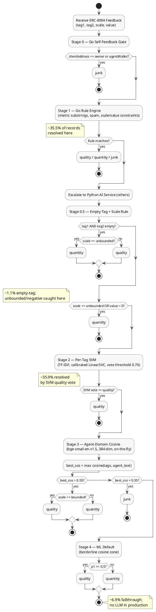

# Chapter 4: Feedback Classification Pipeline

## 4.1 Introduction

### 4.1.1 Decentralized Agent Economies and the Reputation Problem

The emergence of decentralized multi-agent systems has introduced a paradigm shift in how autonomous digital entities interact, negotiate, and transact. In these environments, software agents act as independent economic actors, executing tasks ranging from simple data aggregation to complex financial arbitrage and supply-chain coordination. Because these agents operate in trustless, permissionless networks—often built on blockchain infrastructure—establishing a reliable trust and reputation mechanism is critical. Without a systematic method to evaluate agent reliability, malicious actors can exploit the network through Sybil attacks, free-riding, or active deception.

Reputation systems in decentralized environments have historically relied on structured feedback mechanisms, such as EigenTrust, PageRank variants, or binary rating systems. However, autonomous agents present unique challenges: their operational performance is multi-dimensional, combining objective execution metrics (e.g., speed, uptime) with subjective assessments of cooperation and quality.

### 4.1.2 The ERC-8004 Standard

The ERC-8004 standard addresses this need by providing a standardized smart-contract interface for recording agent feedback. Under ERC-8004, entities submit feedback in a structured format containing four primary fields: `tag1` (a primary descriptive label representing the core dimension of evaluation), `tag2` (an optional secondary label providing sub-context), `scale` (representing the evaluation bounds, typically categorized as *bounded* or *unbounded*), and `value` (the numerical score or magnitude assigned to the feedback).

By design, the ERC-8004 schema allows free-form text input for the tags to accommodate the diverse operational domains of different agents. While this flexibility is necessary to capture domain-specific feedback, it creates a significant classification problem. Free-form text fields are susceptible to noise, formatting inconsistencies, and intentional manipulation.

### 4.1.3 The Need for Automated Classification

Without an automated, high-throughput classification pipeline, the trust score calculation would be vulnerable to pollution from three major sources. First, **spam and gibberish** from Sybil bots or compromised accounts submitting arbitrary strings, UUIDs, random emojis, or incoherent character sequences consume network bandwidth and distort transaction histories. Second, **quantitative performance metrics** logged automatically by monitoring systems (such as execution latency or message throughput) mix poorly with qualitative reputation scores: an unbounded metric such as a throughput of 10,000 transactions cannot be meaningfully combined with a normalized trust rating of 0.95 without breaking the mathematical foundation of the reputation system. Third, **self-feedback**—agents submitting positive evaluations to themselves—represents a common Sybil-style exploit that artificially inflates public reputation scores.

To address these vulnerabilities, the primary goal of the classification pipeline is to automatically, accurately, and rapidly categorize incoming ERC-8004 feedback into four mutually exclusive classes: `quality`, `quantity`, `junk`, and `others` (escalated for downstream ML/LLM resolution). By separating qualitative evaluations from quantitative metrics and filtering out noise, the pipeline maintains the integrity of the downstream trust scoring system. This chapter describes the design, dataset construction, architecture, and evaluation of this classification pipeline.

---

## 4.2 Taxonomy Design

To establish a clean, consistent trust model, we define a taxonomy of four mutually exclusive feedback categories. This taxonomy maps the broad, heterogeneous space of free-form ERC-8004 inputs into a structured schema that determines whether and how a given feedback record influences an agent's trust score.

| Category | Description | Feeds Trust Score |
|----------|-------------|-------------------|
| **quality** | Qualitative, subjective feedback evaluating the agent's behavior, trustworthiness, or service quality. Requires a bounded, positive score. | **Yes** — directly feeds the reputation weight |
| **quantity** | Quantitative, objective performance metrics: throughput, latency, count, P/L, or any unbounded-scale measurement. | **No** — stored for performance profiling |
| **junk** | Noise: gibberish, empty tags, spam URLs, UUIDs, self-feedback, or records with no semantic content. | **No** — discarded |
| **others** | Records the rule engine cannot classify deterministically; escalated to the ML/LLM pipeline. | Resolved downstream |

### 4.2.1 Rationale for the quality/quantity Boundary

The separation of feedback into `quality` and `quantity` is rooted in measurement theory. Qualitative feedback represents subjective human or heuristic evaluations of an agent's behavior (e.g., "helpful", "compliant", "trusted"). These evaluations must be normalized within a fixed range to be mathematically combined into a trust metric. Conversely, quantitative feedback represents objective, physical measurements of system execution (e.g., latency in milliseconds, transaction count). These metrics are unbounded and can scale arbitrarily. Combining an unbounded metric with a qualitative bounded score would cause the unbounded quantity to dominate the qualitative rating, rendering the trust score uninterpretable.

Two structural signals enforce this boundary. First, any feedback submitted with `scale = "unbounded"` is always classified as `quantity`, regardless of tag content—there is no valid qualitative meaning to an uncapped measurement. Second, negative numerical values (e.g., `value < 0`) imply financial loss or directional delta rather than a satisfaction rating; they are likewise classified as `quantity`.

### 4.2.2 Deterministic Gold Labeling Conventions

To establish a ground truth for evaluation, we define a set of deterministic rules called the **gold labeling convention**. These rules analyze the structural and semantic properties of each feedback record:

1. **Self-feedback exclusion.** If the submitter address matches the agent's owner or operational wallet address, the record is immediately classified as `junk`. This mirrors the self-feedback gate implemented in the Go runtime.

2. **Junk detection.** If `tag1` or `tag2` contains only gibberish (random letter sequences, pure UUID strings), spam URLs (`https://`, `t.me/`), vote-rigging phrases (`"top 1 rank"`), or confirmed noise tokens (e.g., `"asd"`, `"vibez"`, `"claudelance"`), the record is classified as `junk`.

3. **Metric substring matching.** If either tag contains a known metric-related substring—including `"rate"`, `"ratio"`, `"count"`, `"amount"`, `"speed"`, `"latency"`, `"uptime"`, `"freshness"`, `"coefficient"`, `"index"`, `"volume"`, `"rank"`, `"p&l"`, `"win"`—the record is classified as `quantity`. Tags containing `"trust"` or `"fitness"` are excluded from this rule, as they represent qualitative reputation assessments rather than raw statistics.

4. **Negative value.** If the numerical `value` field is negative, the record is classified as `quantity`; a negative score is not a valid bounded quality rating.

5. **Unbounded scale.** If `scale = "unbounded"`, the record is classified as `quantity`.

6. **Default.** Everything remaining (bounded, non-metric, non-gibberish) defaults to `quality`.

---

## 4.3 Dataset Construction

To train and evaluate the classification pipeline, we constructed a representative labelled dataset from historical ERC-8004 feedback logs. The process combined human labeling, programmatic weak supervision, external database synchronization, and data sanitization.

### 4.3.1 Gold Set: Human-Labeled Records

The core evaluation set consists of **320 records** labeled by human annotators according to the gold labeling convention defined in Section 4.2.2. These records were drawn from the production `feedback_history` MongoDB collection, spanning multiple chains, agent types, and feedback domains. Human labeling resolved ambiguous cases—such as tag pairs that look like metrics but belong to qualitative service dimensions—that the deterministic rules cannot handle alone.

### 4.3.2 Silver Set: Programmatic Labeling with Stratified Sampling

Scaling beyond 320 labeled records via full manual annotation is cost-prohibitive. We instead applied weak supervision principles, as established by the Snorkel framework, to generate a **silver set of 1,689 records** using the deterministic gold labeling convention as the primary labeling function. This approach is valid for the majority of records where the structural signals (scale, value, tag substrings) unambiguously determine the category.

A critical design decision was the **stratified sampling strategy**: rather than sampling exclusively from the `others` pool (records the rule engine cannot classify), we sampled from all four runtime rule categories—`quality`, `quantity`, `junk`, and `others`—with per-signature caps (maximum 3–6 per unique `tag1`/`tag2`/`scale` triple) and per-agent caps (maximum 10–20 records per agent). This prevents the test set from being dominated by a single agent's feedback pattern or a single tag template, which would artificially inflate evaluation scores. The sampling proportions were: quantity (900 target), quality (700), others (700), junk (300).

For borderline cases in the `others` pool—records where the deterministic convention produces uncertain output—we employed Claude Opus with full agent domain context (agent description, OASF domains, OASF skills, and registered service endpoints) to review and confirm or override labels. This human-in-the-loop step ensured that the silver set's minority classes (quantity, junk) were high-precision even when convention rules were ambiguous.

### 4.3.3 MongoDB Scale Synchronization

After initial label generation, we detected a **state-drift issue**: historical CSV snapshots contained scale values (`valueScale` field) that no longer matched the current production MongoDB state. This drift occurred because the Go runtime's `AssignTier()` function was subsequently patched to correctly classify negative values as `"unbounded"` rather than `"star5"`, causing downstream reprocessing to update some records' effective scale. An offline synchronization script queried MongoDB for all 2,009 feedback IDs and detected **20 scale mismatches** (e.g., `identity/template` changed from `star5` to `unbounded`, `collaboration/reliability` from `star5` to `binary`). The convention labels were then regenerated for affected records, resulting in **46 category changes**—predominantly `quality` → `quantity` for records whose scale shifted to `unbounded`.

### 4.3.4 Train-Leak Removal and Final Dataset

To prevent training data from contaminating the evaluation benchmark, we removed all records that appeared in any training split (specifically the `rule_based_diverse_v2` and `agent_enriched` group A/B splits used for SVM training). A total of **721 records** were excluded. Additionally, 34 self-feedback records were excluded from ML/LLM evaluation (they are handled deterministically by the self-feedback gate and need not be evaluated against the ML stages).

The final cleaned benchmark dataset contains **N = 1,975 records** with the following distribution:

| Class | Count | Proportion |
|-------|-------|------------|
| quality | 1,368 | 69.3% |
| quantity | 582 | 29.5% |
| junk | 25 | 1.3% |
| **Total** | **1,975** | 100% |

Of these, **1,715 records (86.8%)** are classified as *Rich* (agent metadata available: description, OASF domains/skills, services) and **260 records (13.2%)** as *Poor* (no agent metadata, pipeline must rely on scale heuristics).

---

## 4.4 Pipeline Architecture

The feedback classification pipeline is structured as a cascaded decision system. This architecture optimizes both accuracy and throughput by routing easy cases through fast deterministic rules, reserving computationally expensive embedding operations for the minority of records that require semantic disambiguation.

The pipeline operates across two runtime environments. The **Go rule engine** (Stages 0–1) runs inside the trust-graph-updater service and handles self-feedback detection and deterministic rule matching before the record reaches the AI service. The **Python AI service** (Stages 0.5–4) receives only records the Go engine escalates as `others` and executes the SVM, cosine similarity, and optional LLM stages.

### 4.4.1 Stage 0 — Self-Feedback Gate (Go)

The first stage runs entirely in the Go trust-graph-updater service before any message is dispatched to the AI service. It compares the submitter's `clientAddress` against the agent's `owner` and `agentWallet` fields (all stored in lowercase for normalization). A match immediately classifies the record as `junk` and short-circuits the pipeline. This stage mirrors the EigenTrust self-loop exclusion principle and prevents Sybil-style reputation inflation without incurring any ML inference cost.

### 4.4.2 Stage 1 — Deterministic Rule Engine (Go)

The Go rule engine applies the gold labeling convention (Section 4.2.2) deterministically: metric substring matching, spam URL detection, scale and value constraints. Records the rule engine can classify with high confidence are resolved immediately; only ambiguous `others` records are forwarded to the Python AI service. This stage resolves **35.5% (701 records)** of the evaluation set.

### 4.4.3 Stage 0.5 — Empty-Tag and Scale Rule (Python)

Among the `others` records received by the Python service, a subset has both tags empty or carries a structurally decisive scale signal. Empty `tag1`/`tag2` on an unbounded scale indicates a raw metric submission → `quantity`; on a bounded scale it defaults to `quality`. Any record with `scale = "unbounded"` or `value < 0` is routed to `quantity` at this stage, enforcing the core convention that quality is only a positive bounded score. This stage handles **1.1% (21 records)** of the evaluation set.

### 4.4.4 Stage 2 — Per-Tag SVM (Python)

The per-tag SVM is a calibrated `LinearSVC` trained on TF-IDF features of the text string `"tag=<tag> | scale=<scale>"`. Two independent probabilities are computed: $p_1$ for `tag1` and $p_2$ for `tag2`. A symmetric voting function promotes confident agreement above a threshold of 0.70: if either or both tags vote `quality` without contradiction, the record is classified as `quality`. A `non_quality` vote or an unresolved conflict (one quality, one non_quality) escalates to Stage 3.

Per-tag modeling was chosen over pair-SVM for a structural reason: a model trained on `(tag1, tag2)` pairs suffers from combinatorial sparsity—most unique pairs appear only once or twice in the training corpus. Training on individual tags allows the SVM to learn that `"uptime"` is reliably a quantity signal regardless of what `tag2` says, without requiring the pair `("uptime", "reliability")` to appear in training. This stage resolves **35.9% (710 records)** of the evaluation set.

### 4.4.5 Stage 3 — Agent-Domain Cosine Similarity (Python / FAISS)

Stage 3 addresses the fundamental ambiguity of tags that are neither clearly quantitative nor clearly qualitative in isolation: their meaning depends on the agent's business domain. The tag `"revenues/reliability"` is a meaningful quantity metric for a financial trading agent but would be semantically suspicious from a pure-infrastructure liveness probe.

Agent metadata (description, summarized description, OASF domains, OASF skills) is concatenated into a single `agent_text` string and embedded on-the-fly using `BAAI/bge-small-en-v1.5` (384-dimensional Sentence-BERT model). The feedback tags are embedded with the same encoder, and the maximum cosine similarity between any tag embedding and the agent text embedding is computed:

$$\text{best\_cos} = \max_{t \in \{tag_1, tag_2\}} \cos\bigl(\mathbf{e}(t),\; \mathbf{e}(\text{agent\_text})\bigr)$$

If $\text{best\_cos} > 0.55$, the tag is considered **in-domain**: bounded scale → `quality`; unbounded scale → `quantity`. If $\text{best\_cos} < 0.35$, the tag is considered **out-of-domain** and the record is classified as `junk`. The borderline zone $[0.35, 0.55]$ escalates to Stage 4.

The `bge-small-en-v1.5` model was selected for its balance of embedding quality and inference speed on CPU: at 384 dimensions it runs significantly faster than larger models (e.g., `bge-base` at 768 dimensions) while maintaining sufficient semantic resolution for domain-level matching. Embeddings are generated on-the-fly per request, eliminating the need for a prebuilt per-agent index and enabling immediate use of newly registered agents. This stage resolves **20.6% (406 records)** of the evaluation set.

### 4.4.6 Stage 4 — ML Default

The final fallback applies to records whose cosine similarity falls in the borderline zone. Rather than invoking an LLM (which would introduce significant latency), the production pipeline falls back to the per-tag SVM probability: if $p_1 \geq 0.5$, the record is classified as `quality`; otherwise `quantity`. This simple heuristic is deterministic, zero-latency, and handles **6.9% (137 records)** of the evaluation set.

---

## 4.5 LLM Prompt Engineering

Large Language Models offer rich semantic understanding that could, in principle, resolve the ambiguous borderline cases that Stage 4 handles with a simple heuristic. We investigated replacing Stage 4 with an LLM call using the `qwen2.5:7b-instruct` model via the local Ollama inference server. This configuration is referred to as Run 5 in the ablation study.

### 4.5.1 V8 Prompt Structure

The V8 prompt employs a two-path architecture conditioned on the `scale` field. The **unbounded path** presents the model with only two valid output categories (`junk` and `quantity`), since `quality` is structurally impossible on an unbounded scale. The **bounded path** allows all three categories (`junk`, `quantity`, `quality`), with a three-layer decision cascade. Both paths share a common junk definition, a quantity layer based on statistic/metric tag detection, and a quality default layer.

### 4.5.2 Failure Analysis of the Original V8 Prompt

The original V8 prompt yielded a Macro F1 of 0.7411—significantly below Run 4's 0.8314. A systematic audit of the 137 borderline records handled by the LLM revealed **30 false-positive junk predictions** (records the LLM incorrectly classified as `junk`). These fell into two patterns.

**Pattern 1 (22 of 30 cases): Unbounded scale with informal or obscure tags.** Records such as `revenues/reliability` (scale=unbounded), `identity/template` (scale=unbounded), and `sibylcap/positive` (scale=unbounded) were classified as `junk` by the LLM. The model ignored the structural `scale=unbounded` signal—which mandates `quantity` under the convention—and instead applied a stylistic heuristic: tags that do not "sound professional" or technical were deemed meaningless. This reveals that the LLM prioritizes linguistic surface form over structural fields when the prompt does not impose an explicit hard gate.

**Pattern 2 (8 of 30 cases): Bounded scale with casual or slang tags.** Records such as `"gud tek"` (binary), `"uh oh"` (binary), `"natillera/celo"` (pct100), and `"accuracy/top noth"` (pct100) were misclassified as `junk`. The LLM applied an implicit "must sound professional" criterion: casual language, crypto community names, and misspellings were treated as noise. However, per the gold convention, any tag containing recognizable words on a bounded scale should default to `quality`—casual phrasing is not grounds for junk classification.

### 4.5.3 Prompt Optimization

Two targeted fixes resolved both patterns without introducing tag-specific hard-coding:

**Fix 1 — Stricter junk definition.** The junk layer was updated to enumerate only provably meaningless content: pure random characters (no recognizable words), bare index digits (no label or unit), spam URLs, and rank-game phrases. The updated layer explicitly states: *"NEVER junk: slang, casual expressions, informal words, meme phrases, crypto/protocol/community names you don't recognise. WHEN UNCERTAIN between junk and the next layer → always choose the next layer."*

**Fix 2 — Hard unbounded decision flow.** The unbounded-path decision flow was restructured to make `quantity` the default, with `junk` reserved exclusively for clear spam or pure random characters: *"(1) Tags are clearly spam or pure random characters? → junk. (2) Everything else → quantity (informal, slang, crypto names = quantity on unbounded)."* Similarly, the bounded path was updated to end with *"when uncertain between junk and quality → ALWAYS choose quality."*

These two rule changes—both conceptual and expressible in natural language without referencing specific tags—reduced the false-positive junk count from 30 to approximately 1, recovering junk precision from 0.30 to 0.93 and improving the overall Macro F1 from 0.7411 to 0.8481.

---

## 4.6 Evaluation

### 4.6.1 Ablation Methodology

We evaluated six pipeline configurations in an ablation study on the cleaned benchmark dataset (N=1,975, self-feedback excluded). All runs share the same Stage 0/1 Go rule engine baseline; runs 3–5b vary only the Python-side stages. We report Macro F1 as the primary metric, with per-class precision/recall and Rich/Poor split F1 as diagnostic metrics. Macro F1 weights all three classes equally, making it sensitive to minority-class (junk) performance.

### 4.6.2 Ablation Results

| Run | Pipeline Configuration | Macro F1 | Rich F1 | Poor F1 |
|-----|------------------------|---------|---------|---------|
| 1 | Rule Only | 0.6078 | 0.6099 | 0.4054 |
| 2 | Rule + SVM Pair (baseline) | 0.7775 | 0.7877 | 0.5989 |
| 3 | Rule + Per-Tag SVM | 0.7531 | 0.7656 | 0.4843 |
| 4 | Rule + Per-Tag SVM + FAISS **(production)** | **0.8314** | **0.8396** | 0.5907 |
| 5 | Rule + Per-Tag SVM + FAISS + LLM V8 (original) | 0.7411 | 0.7473 | 0.6251 |
| 5b | Rule + Per-Tag SVM + FAISS + LLM V8 (fixed) | **0.8481** | **0.8572** | **0.6455** |

### 4.6.3 Analysis

**Rule Only (Run 1, Macro F1 = 0.6078).** The deterministic rule engine alone achieves moderate performance by handling clear-cut cases. The low recall for `quality` (0.19) reveals the fundamental limitation: 64.5% of records—the `others` pool—are returned as unresolved defaults, receiving no meaningful classification. Without a downstream ML stage, nearly two-thirds of feedback cannot be accurately categorized.

**SVM Pair Baseline (Run 2, Macro F1 = 0.7775).** Adding a pairwise SVM substantially improves quality recall. However, junk precision is low at 0.41, indicating the pair-SVM frequently misclassifies non-junk records as junk. The pair-SVM suffers from data sparsity on unseen tag combinations.

**Per-Tag SVM (Run 3, Macro F1 = 0.7531).** Switching to independent per-tag SVMs reduces junk false positives (precision returns to 1.00) but increases the quantity false-negative rate, as the per-tag model without domain context cannot distinguish in-domain quantity signals from quality signals. This produces a quantity F1 of 0.73 versus 0.84 in Run 2, revealing that per-tag SVMs trade junk precision for quantity recall.

**Agent-Domain Cosine / FAISS (Run 4, Macro F1 = 0.8314).** The addition of agent-domain cosine similarity in Stage 3 delivers the largest single gain in the ablation: **+0.078 Macro F1** over Run 3. By grounding tag semantics in the agent's business domain, Stage 3 resolves the quantity/quality ambiguity that the SVM cannot address in isolation. Quality F1 rises from 0.85 to 0.94 and quantity F1 from 0.73 to 0.87. Run 4 constitutes the **production deployment configuration**.

**LLM V8 Original (Run 5, Macro F1 = 0.7411).** Replacing Stage 4 ML default with an LLM call causes a pronounced regression. As analyzed in Section 4.5.2, the LLM over-predicts junk for borderline records with informal or domain-specific tags, collapsing junk precision from 1.00 to 0.30. This single failure mode reduces Macro F1 below Run 3 performance, demonstrating that an unprompted LLM is counterproductive for this task.

**LLM V8 Fixed (Run 5b, Macro F1 = 0.8481).** The prompt-optimized LLM pipeline surpasses Run 4 by 0.017 Macro F1 and achieves the highest performance on the Poor split (0.6455 vs. 0.5907). The improvement on Poor records is expected: where agent metadata is absent, the cosine stage has no signal, but the LLM can reason about tag semantics independently of agent context—provided the prompt correctly constrains its junk threshold.

### 4.6.4 Run 4 Per-Class Performance

The production pipeline (Run 4) achieves the following per-class results:

| Class | Precision | Recall | F1-Score | Support |
|-------|-----------|--------|----------|---------|
| junk | 1.00 | 0.52 | 0.68 | 25 |
| quality | 0.93 | 0.95 | 0.94 | 1,368 |
| quantity | 0.89 | 0.85 | 0.87 | 582 |
| **Overall Accuracy** | | | **0.92** | **1,975** |

The junk class achieves perfect precision (no false positive junk predictions) but moderate recall (0.52). This asymmetry is intentional: mislabeling a valid record as `junk` permanently removes it from trust scoring (a false negative for the agent), whereas routing a junk record to `quality` or `quantity` pollutes the trust score. High precision on junk is therefore the more critical objective for production correctness.

### 4.6.5 Rich vs. Poor Metadata Gap

Across all pipeline configurations, a consistent performance gap exists between Rich and Poor records. In the production pipeline (Run 4), Rich records achieve a Macro F1 of 0.8396 while Poor records achieve 0.5907—a gap of **0.2489 points**. This gap is structurally expected: Stage 3 (agent-domain cosine) requires agent metadata to compute meaningful similarity scores. When metadata is absent, Stage 3 is skipped and the pipeline falls through to Stage 4's simple ML default. The LLM-fixed pipeline (Run 5b) partially closes this gap, improving Poor F1 to 0.6455 (+0.055 over Run 4), confirming that LLM semantic reasoning provides marginal benefit in the absence of structured agent context.

### 4.6.6 Production Deployment Trade-off

Run 5b achieves the highest Macro F1 (0.8481) but introduces a latency cost. The production pipeline (Run 4) processes messages at **330 messages per second** using compiled Go rules, lightweight SVM inference, and local bge-small embedding—all running on a single CPU core. The LLM pipeline operates at **1.4 messages per second** (Ollama, `qwen2.5:7b-instruct`), representing a **236× throughput penalty**. Each borderline call incurs an average latency of **1,977 ms**.

Because Run 5b's improvement is concentrated on the 6.9% of records that reach Stage 4 (137 out of 1,975), and the absolute MacroF1 gain is 0.017, the throughput cost does not justify deployment in the current operational context, where the `erc8004.feedback.classified` queue must drain at sustained high throughput. Accordingly, Run 4 was selected as the production configuration.

---

## 4.7 Summary

This chapter described the design, construction, and evaluation of the ERC-8004 Feedback Classification Pipeline. The pipeline addresses a core integrity challenge for decentralized reputation systems: free-form tag-based feedback submitted to a permissionless smart contract is inherently noisy, semantically ambiguous, and susceptible to gaming.

The primary contribution of this work is a **six-stage cascaded classifier** that combines deterministic rule matching in Go, per-tag SVM inference, and agent-domain cosine similarity via a lightweight Sentence-BERT embedding model. The pipeline is designed for high throughput (330 msg/s) while maintaining strong classification accuracy (Macro F1 = 0.8314 on a 1,975-record benchmark).

Several key findings emerged from the ablation study and failure analysis. First, incorporating agent-domain context via embedding cosine similarity provided the largest single-stage performance gain (+0.078 Macro F1), confirming that tags cannot be interpreted in isolation from the agent's business domain. Second, per-tag SVM modeling outperforms pairwise SVM on unseen tag combinations by avoiding combinatorial data sparsity. Third, LLMs, while capable of high final accuracy (0.8481 with optimized prompting), are sensitive to prompt framing: without explicit structural rules constraining the junk threshold and scale signals, an LLM defaults to stylistic heuristics that produce systematic false-positive junk predictions on informal or domain-specific tags.

The production deployment of Run 4 (model `"3tier"` in the AI service, wired via `AI_SERVICE_MODEL=3tier` in the trust-graph-updater) achieves a 236× throughput improvement over the LLM baseline while sacrificing only 0.017 Macro F1—a trade-off that is appropriate for a real-time blockchain feedback processing system operating at sustained high message volume.
